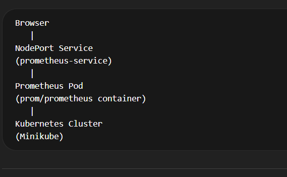

Prometheus Step-by-step Deployment Guide

# Create a folder 
mkdir promethius-deployment

# Create the files
prometheus-deployment.yaml
prometheus-service.yaml

# Supply the source codes to the files

# Deploy the application

kubectl apply -f prometheus-deployment.yaml

kubectl apply -f prometheus-service.yaml

# Verify the Pod

kubectl get pods

# Verify the Service
kubectl get svc

# Access Prometheus from Browser

minikube service prometheus-service

# Check Deployment Logs (Optional)
kubectl logs deployment/prometheus-deployment

# Delete Resources (Cleanup)

kubectl delete -f prometheus-deployment.yaml
kubectl delete -f prometheus-service.yaml

# Architecture

